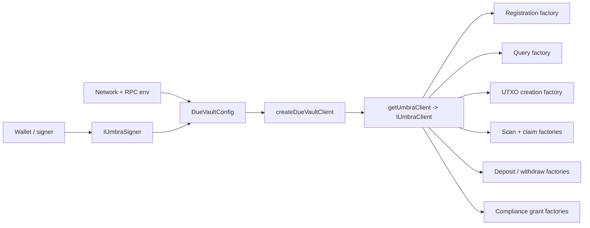
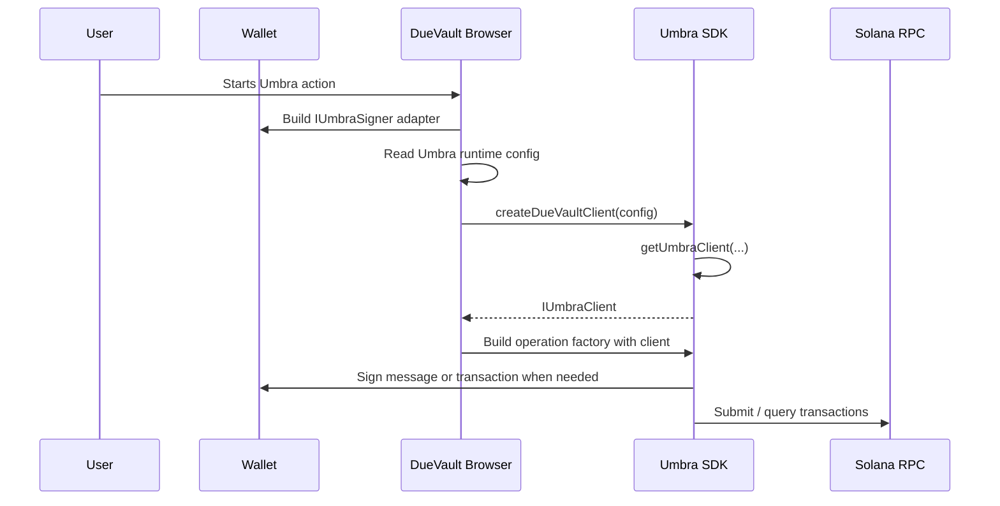
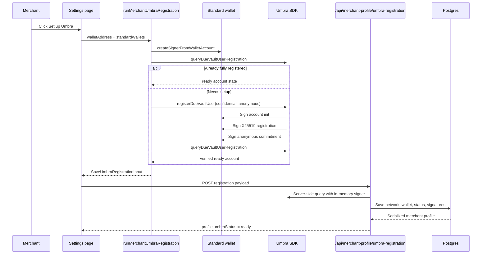
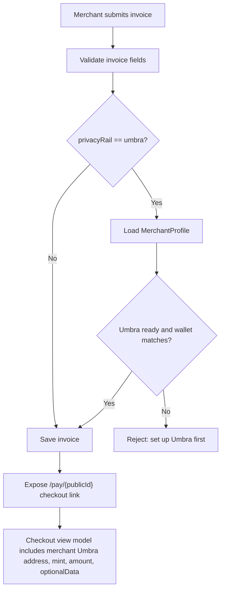
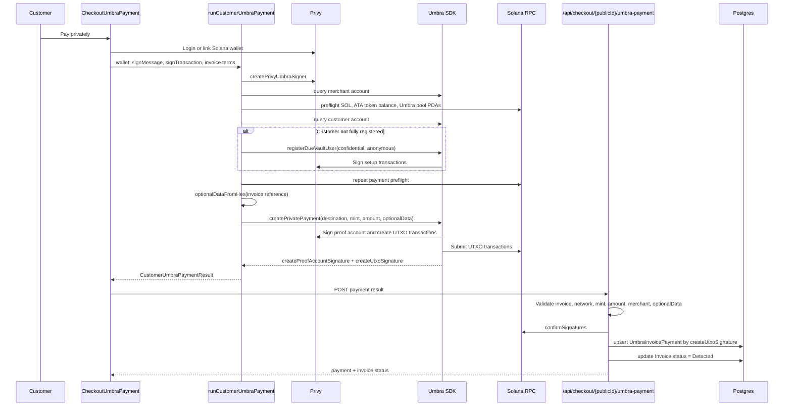
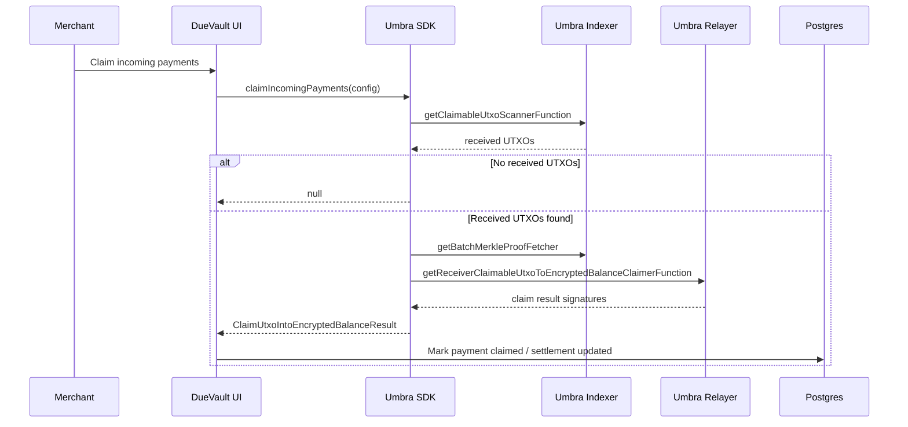
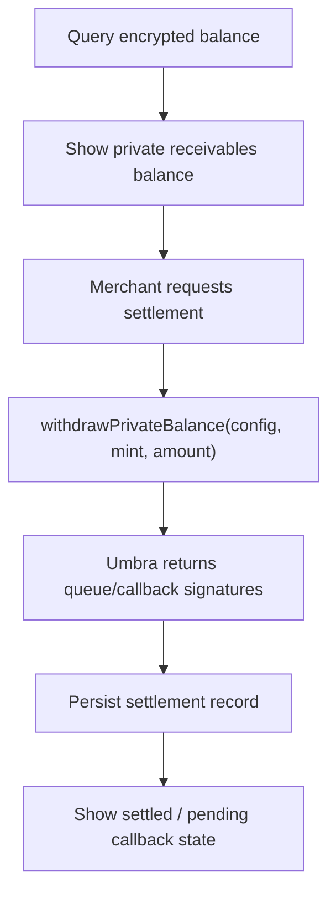
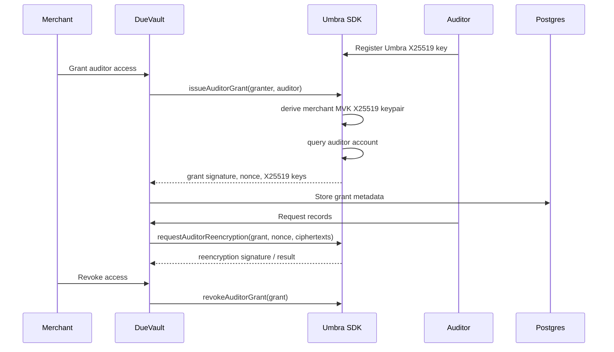
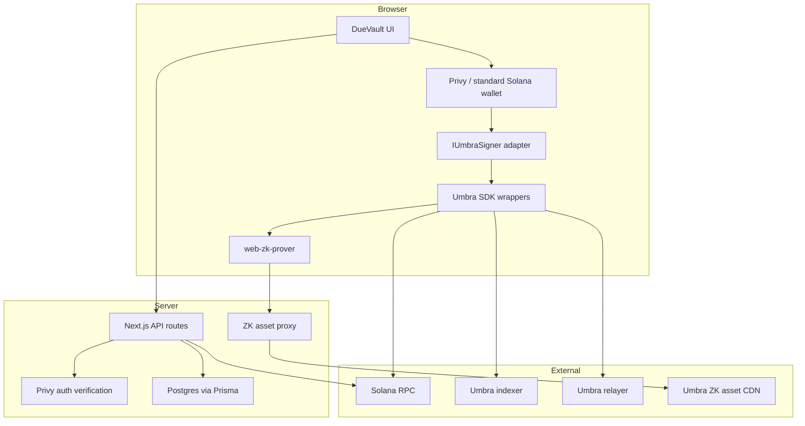

# Umbra SDK Product Flows for DueVault

This document maps the Umbra SDK surface that matters to DueVault, the user-facing flows we can build on top of it, and the code sequence each flow needs to follow to become a product feature.

## Product Position

DueVault should treat Umbra as the private settlement rail behind business receivables:

- Merchants register their receivables wallet once for Umbra confidential and anonymous usage.
- Invoices carry a stable 32-byte Umbra reference derived from the invoice public ID.
- Customers pay into the merchant's Umbra receiver-claimable UTXO path from their public token balance.
- DueVault stores off-chain business context, invoice status, signatures, optional data, and audit state.
- Merchants later claim, settle, withdraw, or share records without exposing the whole treasury graph.

The important boundary is: wallet-signed Umbra actions run in the browser, while the server verifies network, mint, amount, invoice reference, transaction confirmation, and owned database state.

## Source Files

- `lib/umbra/sdk.ts`: DueVault's app-facing Umbra wrapper.
- `lib/umbra/config.ts`: runtime network and RPC configuration.
- `lib/umbra/zk-assets.ts`: browser ZK asset provider through the app proxy.
- `features/merchant-profiles/umbra-registration.ts`: merchant registration runner.
- `features/checkout/umbra-payment.ts`: customer payment runner.
- `features/checkout/privy-umbra-signer.ts`: Privy Solana wallet adapter for `IUmbraSigner`.
- `app/api/merchant-profile/umbra-registration/route.ts`: server verification before saving merchant readiness.
- `app/api/checkout/[publicId]/umbra-payment/route.ts`: server verification before saving private invoice payment.
- `features/checkout/service.ts`: checkout view model and invoice optional data.
- `prisma/schema.prisma`: merchant, invoice, and Umbra payment persistence.

## Mental Model

The Umbra SDK is mostly a functional factory API rather than an object-oriented class API. You create an `IUmbraClient`, then pass that client into operation-specific factory functions.



### Core SDK Interfaces

| SDK concept | What it is | DueVault use |
| --- | --- | --- |
| `IUmbraSigner` | Required signer interface with `address`, `signTransaction`, `signTransactions`, and `signMessage`. | Adapt external wallets and Privy wallets into a shape Umbra can use. |
| `IUmbraClient` | Immutable session object created by `getUmbraClient`. Holds signer, network config, RPC providers, key derivation, indexer hooks, and transaction forwarding. | Created per user action with `createDueVaultClient`. |
| `UserRegistrationOptions` | Flags and callbacks for account, X25519, and anonymous registration. | DueVault always requests `{ confidential: true, anonymous: true }`. |
| `TransactionCallbacks` | `pre` and `post` lifecycle hooks around signed transactions. | Drives UI steps such as "Account Init", "Private payment", and "Save result". |
| `QueryUserAccountResult` | Discriminated union: `non_existent` or `exists` with user-account flags. | Gate merchant readiness and checkout readiness. |
| `CreateUtxoFromPublicBalanceResult` | Signatures returned after creating a receiver-claimable UTXO from public token balance. | Stored as invoice payment evidence. |
| `DepositResult` / `WithdrawResult` | Queue and callback signatures for encrypted balance operations. | Useful for future merchant settlement and treasury flows. |

### DueVault Umbra Config

`DueVaultConfig` is the local wrapper shape:

```ts
type DueVaultConfig = {
  network: "mainnet" | "devnet";
  rpcUrl: string;
  rpcSubscriptionsUrl: string;
  signer: IUmbraSigner;
  masterSeedStorage?: ...;
  deferMasterSeedSignature?: boolean;
  preferPollingTransactionForwarder?: boolean;
  indexerApiEndpoint?: string;
  relayerApiEndpoint?: string;
};
```

DueVault defaults to devnet only outside production. Production fails closed
unless the Umbra network and RPC envs are explicitly set:

- `NEXT_PUBLIC_UMBRA_NETWORK`, local default `devnet`; production must be `mainnet`
- `NEXT_PUBLIC_UMBRA_RPC_URL`, local default `https://api.devnet.solana.com`; production required
- `NEXT_PUBLIC_UMBRA_RPC_SUBSCRIPTIONS_URL`, local default `wss://api.devnet.solana.com`; production required
- `NEXT_PUBLIC_CHECKOUT_MINT_ID`, local default by network; production must be `USDC`
- Umbra indexer default `https://indexer.api.umbraprivacy.com`
- Umbra relayer default `https://relayer.api.umbraprivacy.com`

## DueVault Wrapper Functions

### Client and Registration

| DueVault wrapper | Underlying SDK | Product meaning |
| --- | --- | --- |
| `createDueVaultClient(config)` | `getUmbraClient`, optional `getPollingTransactionForwarder` | Build the signed Umbra session for one user action. |
| `registerDueVaultUser(config, options)` | `getUserRegistrationFunction`, `getUserRegistrationProver` | Initialize account, register X25519 key, register anonymous commitment. |
| `queryDueVaultUserRegistration(config, userAddress?)` | `getUserAccountQuerierFunction` | Read Umbra account flags for merchant/customer/auditor. |
| `isUmbraUserFullyRegistered(account)` | Local predicate | Product-ready check for confidential and anonymous Umbra usage. |

Readiness means:

- account exists
- account is initialized
- X25519 key is registered
- user commitment is registered
- account is active for anonymous usage

### Private Balance

| DueVault wrapper | Underlying SDK | Product meaning |
| --- | --- | --- |
| `depositPrivateBalance(config, mint, amount)` | `getPublicBalanceToEncryptedBalanceDirectDepositorFunction` | Move merchant public token balance into encrypted Umbra balance. |
| `withdrawPrivateBalance(config, mint, amount)` | `getEncryptedBalanceToPublicBalanceDirectWithdrawerFunction` | Settle encrypted balance back to public wallet. |

These are not yet the main checkout path. They are better for merchant treasury and settlement views.

### Invoice Payments

| DueVault wrapper | Underlying SDK | Product meaning |
| --- | --- | --- |
| `createPrivatePayment(config, request)` | `getPublicBalanceToReceiverClaimableUtxoCreatorFunction`, `getCreateReceiverClaimableUtxoFromPublicBalanceProver` | Customer pays a merchant invoice by creating a receiver-claimable UTXO from public USDC. |
| `claimIncomingPayments(config)` | `getClaimableUtxoScannerFunction`, `getReceiverClaimableUtxoToEncryptedBalanceClaimerFunction`, `getUmbraRelayer`, `getBatchMerkleProofFetcher` | Merchant scans and claims received UTXOs into encrypted balance. |

DueVault's invoice optional data is:

```ts
sha256("duevault:invoice:" + invoice.publicId)
```

That gives each Umbra payment a stable 32-byte invoice reference while keeping the invoice details in DueVault's database.

### Compliance and Audit

| DueVault wrapper | Underlying SDK | Product meaning |
| --- | --- | --- |
| `issueAuditorGrant(config, request)` | `getComplianceGrantIssuerFunction`, `getMasterViewingKeyX25519KeypairDeriver`, `getUserAccountQuerierFunction` | Merchant grants an auditor access after confirming auditor has X25519 key. |
| `revokeAuditorGrant(config, grant)` | `getComplianceGrantRevokerFunction` | Merchant revokes auditor access. |
| `requestAuditorReencryption(config, grant, nonce, ciphertexts)` | `getSharedCiphertextReencryptorForUserGrantFunction` | Produce encrypted data that an authorized auditor can inspect. |

## Flow 1: SDK Construction



Key product rule: create a new client for the active wallet, network, and action. Do not share a client across users or wallets.

## Flow 2: Merchant Umbra Setup

User perspective:

1. Merchant signs in.
2. Merchant connects the Solana wallet used for the business profile.
3. Merchant opens Settings -> Privacy Controls.
4. Merchant clicks "Set up Umbra".
5. Wallet prompts for account registration transactions and master seed derivation as needed.
6. DueVault verifies the Umbra account on the server.
7. DueVault marks the merchant profile as `umbraStatus = "ready"`.

Code perspective:



Product state changes:

- `MerchantProfile.umbraNetwork`
- `MerchantProfile.umbraStatus`
- `MerchantProfile.umbraWalletAddress`
- `MerchantProfile.umbraRegistrationSignatures`
- `MerchantProfile.umbraRegisteredAt`
- `MerchantProfile.umbraLastCheckedAt`

Important checks:

- Submitted wallet must match the merchant profile primary wallet.
- Submitted network must match server Umbra config.
- Server re-queries Umbra and refuses to save unless fully registered.

## Flow 3: Create an Umbra Invoice

User perspective:

1. Merchant creates or edits an invoice.
2. Merchant chooses the Umbra privacy rail.
3. DueVault requires merchant Umbra setup before saving an Umbra invoice.
4. DueVault creates a public checkout link using `invoice.publicId`.

Code perspective:



The checkout view model includes:

- merchant display data
- amount in human and atomic units
- configured USDC mint
- merchant Umbra network/status/address
- optional data derived from `publicId`
- latest stored Umbra payment if one exists

## Flow 4: Customer Private Checkout Payment

User perspective:

1. Customer opens `/pay/{invoiceId}`.
2. Customer logs in or links a Solana wallet through Privy.
3. Customer selects the wallet to pay from.
4. DueVault checks merchant readiness, customer SOL, customer USDC, token pool readiness, and customer Umbra account readiness.
5. If customer is not registered with Umbra, DueVault registers them during checkout.
6. Customer approves the Umbra payment transactions.
7. DueVault verifies signatures on-chain.
8. DueVault records the payment and marks the invoice as detected.

Code perspective:



The saved payment record is intentionally minimal and verifiable:

- payer wallet address
- merchant Umbra wallet address
- network
- mint
- amount atomic
- optional data
- proof account signature
- UTXO creation signature
- confirmation timestamp

This gives DueVault an off-chain receivables ledger linked to on-chain Umbra evidence.

## Flow 5: Merchant Claim Incoming Payments

This wrapper exists but is not yet wired into the product UI.

User perspective:

1. Merchant opens invoice detail, settlement, or activity.
2. DueVault shows confirmed private payments awaiting claim.
3. Merchant clicks "Claim to private balance".
4. Merchant signs with the registered Umbra wallet.
5. Umbra scans receiver-claimable UTXOs and claims them into the merchant encrypted balance.
6. DueVault updates payment or settlement status.

Code perspective:



Product work needed:

- Add a claim button or background reconciliation action.
- Persist claim signatures and claim timestamps.
- Add statuses such as `confirmed`, `claiming`, `claimed`, `claim_failed`.
- Decide whether claiming is per invoice, per merchant batch, or both.

## Flow 6: Private Balance and Settlement

User perspective:

1. Merchant sees private USDC balance inside DueVault.
2. Merchant chooses to settle part or all of it.
3. Merchant signs a withdrawal.
4. DueVault records the settlement event and shows the public withdrawal signature.

Code perspective:



Current wrapper coverage:

- `depositPrivateBalance` exists for moving public funds into encrypted balance.
- `withdrawPrivateBalance` exists for moving encrypted funds out.
- A `queryPrivateBalance` wrapper should be added using `getEncryptedBalanceQuerierFunction`.
- A `Settlement` table should store mint, amount, status, queue signature, callback signature, and error state.

## Flow 7: Auditor and Selective Disclosure

User perspective:

1. Auditor creates or connects an Umbra-ready wallet.
2. Merchant chooses the auditor and grant scope in DueVault.
3. Merchant signs an auditor grant.
4. DueVault records the grant metadata.
5. Auditor receives only the re-encrypted records the merchant authorizes.
6. Merchant can revoke the grant later.

Code perspective:



Product work needed:

- Add auditor identity model.
- Add grant table with auditor address, grant nonce, X25519 keys, status, issue signature, revoke signature.
- Decide record-level scope: invoice, date range, customer, tax period, or full merchant export.
- Add export UX for accountants and compliance reviewers.

## Product Sequences We Can Build

### Sequence A: "Stealth-ready merchant"

Build this as the onboarding requirement for Umbra invoices.

User steps:

1. Sign in.
2. Link Solana wallet.
3. Create merchant profile.
4. Click "Set up Umbra".
5. Wait for account, encryption key, and anonymous commitment steps.
6. See status "Ready".

Code steps:

1. `createSignerFromWalletAccount(...)`
2. `queryDueVaultUserRegistration(config, walletAddress)`
3. `registerDueVaultUser(config, callbacks)` if not ready
4. `queryDueVaultUserRegistration(config, walletAddress)` again
5. `POST /api/merchant-profile/umbra-registration`
6. server rechecks with `queryDueVaultUserRegistration`
7. `saveMerchantUmbraRegistration(...)`

Product output:

- Merchant can create Umbra invoices.
- Checkout pages can expose the merchant Umbra receiver address.

### Sequence B: "Private invoice checkout"

Build this as the core DueVault payment product.

User steps:

1. Merchant sends checkout link.
2. Customer opens invoice.
3. Customer connects wallet.
4. Customer pays privately.
5. Merchant sees invoice status become "Detected".

Code steps:

1. `buildUmbraInvoiceOptionalData(publicId)`
2. `createPrivyUmbraSigner(...)`
3. `queryDueVaultUserRegistration(config, merchantAddress)`
4. preflight SOL, token ATA, and Umbra pool PDAs
5. `queryDueVaultUserRegistration(config, customerAddress)`
6. `registerDueVaultUser(config, callbacks)` if needed
7. `createPrivatePayment(config, { destinationAddress, mint, amount, optionalData })`
8. `POST /api/checkout/{publicId}/umbra-payment`
9. server confirms signatures and writes `UmbraInvoicePayment`

Product output:

- Invoice has a confirmed private payment record.
- The on-chain evidence is linked to invoice context through optional data.

### Sequence C: "Claim and reconcile receivables"

Build this after checkout is stable.

User steps:

1. Merchant sees confirmed payments awaiting claim.
2. Merchant claims them into encrypted Umbra balance.
3. DueVault reconciles invoice status and private balance.

Code steps:

1. Build signer for merchant wallet.
2. `claimIncomingPayments(config)`
3. persist claim result signatures.
4. mark one or more `UmbraInvoicePayment` rows as `claimed`.
5. update invoice lifecycle from `Detected` to `Paid` or `Claimed`.

Product output:

- DueVault moves from "payment detected" to "private receivable settled into merchant control".

### Sequence D: "Private settlement withdrawal"

Build this as the merchant treasury action.

User steps:

1. Merchant chooses an amount to settle.
2. Merchant signs withdrawal.
3. DueVault shows settlement status and signature.

Code steps:

1. Add `queryPrivateBalance(config, mint)` wrapper.
2. `withdrawPrivateBalance(config, mint, amount)`
3. persist settlement event.
4. update dashboard balances.

Product output:

- Merchant can convert private receivables back into public treasury funds when desired.

### Sequence E: "Accountant view"

Build this as DueVault's selective disclosure layer.

User steps:

1. Merchant invites accountant or auditor.
2. Auditor registers Umbra wallet.
3. Merchant grants access.
4. Auditor views approved invoices, payments, and settlement records.
5. Merchant revokes access when done.

Code steps:

1. `queryDueVaultUserRegistration(config, auditorAddress)`
2. `issueAuditorGrant(config, { granterAddress, auditorAddress })`
3. store grant metadata.
4. `requestAuditorReencryption(config, grant, inputEncryptionNonce, ciphertexts)`
5. `revokeAuditorGrant(config, grant)` when access ends.

Product output:

- DueVault becomes useful for businesses that need privacy by default but auditability on demand.

## Recommended Product Architecture



Keep these responsibilities separated:

- Browser: signing, proving, and user-visible progress.
- SDK wrapper: Umbra-specific operation composition.
- API routes: validation, confirmation, auth, idempotency, persistence.
- Database: business records and payment lifecycle.
- External Umbra services: indexer, relayer, ZK assets.

## Immediate DueVault Backlog

1. Add `queryPrivateBalance(config, mint)` using `getEncryptedBalanceQuerierFunction`.
2. Add claim UI around `claimIncomingPayments(config)`.
3. Extend `UmbraInvoicePayment.status` beyond `confirmed` to include claim lifecycle.
4. Add a `Settlement` model for withdrawals from encrypted balance.
5. Add a `ComplianceGrant` or `AuditorGrant` model.
6. Add server-side reconciliation for invoices where the checkout POST is interrupted after the Umbra transaction lands.
7. Add mainnet configuration guardrails for RPC, USDC mint, indexer endpoint, and relayer endpoint.
8. Move long proof generation into a Web Worker if browser responsiveness becomes a problem.

## Implementation Guardrails

- Always validate `optionalData` as exactly 32 bytes before calling Umbra.
- Always verify server-side that network, mint, amount, merchant address, and invoice reference match the invoice.
- Treat `createUtxoSignature` as the idempotency key for customer payment saves.
- Keep `deferMasterSeedSignature: true` so the wallet prompt happens at the user action, not page load.
- Use a click-scoped `masterSeedStorage` for checkout to avoid repeated prompts inside one payment attempt.
- Keep the merchant Umbra wallet equal to the merchant profile primary wallet unless the product explicitly supports separate settlement wallets.
- Never use the server to perform merchant or customer signed Umbra actions. The server can query and verify, but the wallet signs in the browser.
- Surface each `TransactionCallbacks` step in the UI because Umbra flows include multiple transactions and ZK proof generation.
